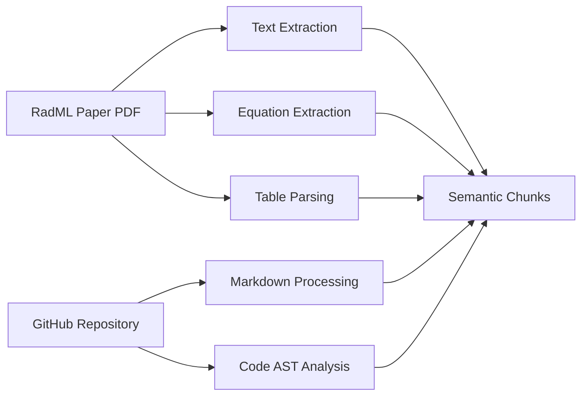
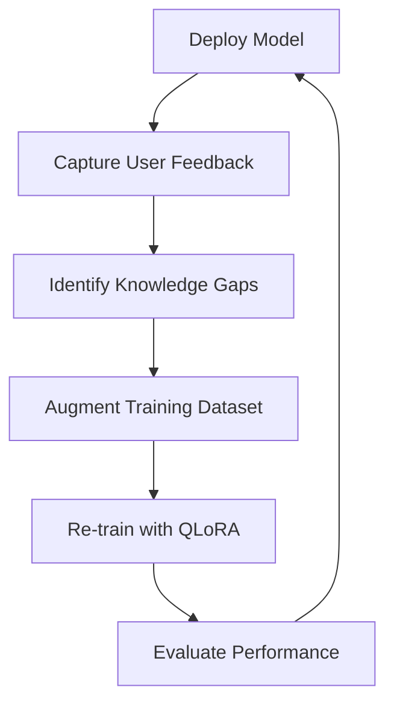

# A Strategic Framework for Developing a Domain-Specific Large Language Model for the RadML Scientific Computing Framework

## Executive Summary

This document presents a comprehensive strategic framework for developing a specialized Large Language Model (LLM) tailored to the RadML (Radiation-Aware Machine Learning) scientific computing framework. The objective is to create an AI system that serves as a true expert on RadML, capable of understanding its intricate interplay of radiation physics, fault-tolerant computing, and machine learning theory. This framework outlines a systematic approach encompassing model selection, dataset curation, efficient fine-tuning techniques, and deployment strategies.

## Table of Contents

1. [Introduction](#introduction)
2. [Foundational Analysis of the RadML Knowledge Domain](#foundational-analysis)
3. [Comparative Evaluation of State-of-the-Art Models](#model-evaluation)
4. [Model Selection and Recommendations](#model-selection)
5. [Domain-Specific Dataset Curation Framework](#dataset-curation)
6. [Technical Implementation with QLoRA](#qlora-implementation)
7. [Strategic Deployment and Future Development](#strategic-deployment)
8. [Conclusion](#conclusion)

---

## 1. Introduction {#introduction}

The RadML framework represents a sophisticated convergence of three highly specialized domains: radiation physics, software engineering, and machine learning. This complexity necessitates the development of a purpose-built LLM that can serve as a digital counterpart to the framework's architect, capable of reasoning about its design, implementation, and theoretical underpinnings.

### Key Objectives

- **Deep Domain Understanding**: Create an LLM that comprehends the interdisciplinary nature of RadML
- **Practical Utility**: Enable interactive documentation, code assistance, and research support
- **Resource Efficiency**: Implement using open-source models with local deployment capabilities
- **Continuous Improvement**: Establish a framework for ongoing model enhancement

---

## 2. Foundational Analysis of the RadML Knowledge Domain {#foundational-analysis}

### 2.1 Interdisciplinary Knowledge Requirements

The RadML framework operates at the intersection of three critical domains:

#### **Radiation Physics**
- **Core Concepts**: Linear Energy Transfer (LET), Single-Event Upsets (SEUs), Multiple-Bit Upsets (MBUs)
- **Mathematical Formalisms**: 
  - SEU probability: `P(SEU) = 1 - exp(-(Q_deposited(E)/Q_critical)^k)`
  - WKB tunneling approximation: `T_WKB = exp(-2w√(2mE_barrier)/ℏ)`
- **Application**: Direct integration within the Physics Modeling Layer

#### **Software Engineering and Fault Tolerance**
- **Implementation Languages**: C++ (87.0%) and Python (9.8%)
- **Key Techniques**:
  - Triple Modular Redundancy (TMR) and adaptive variants
  - Memory scrubbing and checkpointing
  - Radiation-Mapped Allocator for damaged memory avoidance
- **Architecture**: Nine-layer defense-in-depth hierarchy

#### **Machine Learning Theory**
- **Neural Network Concepts**: Weights, biases, activations, residual connections
- **Resilience Mechanisms**: Variational Autoencoders (VAEs), Automated Architecture Search (NAS)
- **Fitness Function**: `Fitness(c) = α·A_baseline(c) + β·A_radiation(c) + γ·P_preservation(c)`

### 2.2 The Nine-Layer Architectural Hierarchy

RadML's defense-in-depth philosophy is embodied in its hierarchical structure:

| Layer | Name | Primary Function |
|-------|------|------------------|
| 1 | Application Layer | User-facing interface |
| 2 | Selective Hardening | Critical component protection |
| 3 | Protection Layer | Redundancy and error correction |
| 4 | Memory Management | Memory integrity maintenance |
| 5 | Physics Modeling | Radiation effect prediction |
| 6 | Hardware Interface | Low-level device interaction |
| 7 | Monitoring & Diagnostics | System health tracking |
| 8 | Mission Environment | External condition modeling |
| 9 | Research & Advanced Features | Experimental capabilities |

### 2.3 Mathematical and Algorithmic Core

The framework's intellectual contribution is captured in key equations:

**Primary Bit-Flip Probability (Equation 2):**
```
P(bit-flip) = [Σᵢ(fᵢ·σᵢ(E)·Cᵢ)] × C_temp × C_solar × C_region × C_device × C_quantum
```

**Resource Allocation Algorithm:**
```
Allocation(c) = α·Criticality(c) + β·ErrorRate(c) + γ·RadiationExposure(c)
```

---

## 3. Comparative Evaluation of State-of-the-Art Models {#model-evaluation}

### 3.1 Evaluation Benchmarks

| Benchmark | Purpose | Relevance to RadML |
|-----------|---------|-------------------|
| **MMLU** | Broad scientific reasoning | Tests understanding of physics and ML concepts |
| **GSM8K** | Mathematical reasoning | Evaluates ability to interpret complex equations |
| **HumanEval/MBPP** | Code generation | Basic code synthesis capabilities |
| **SWE-Bench** | Real-world code modification | Critical for understanding existing codebase |

### 3.2 Candidate Model Performance

| Model | Parameters | MMLU | GSM8K | HumanEval | SWE-Bench | Key Strengths |
|-------|------------|------|--------|-----------|-----------|---------------|
| **DeepSeek Coder V2** | 33B | 78-82% | 95-97% | 86-89% | **20-24%** | Superior math/reasoning, SOTA on complex code |
| **Llama 3.1 70B** | 70B | 82-86% | 94-96% | 85-88% | 18-22% | Top-tier general reasoning, 128K context |
| **Qwen2.5 Coder 32B** | 32B | 72-76% | 85-90% | 88-91% | 17-20% | Excellent multilingual code support |
| **Codestral 22B** | 22B | 70-75% | 80-85% | **90-92%** | 15-18% | SOTA code synthesis, high efficiency |
| **Phi-3-small 7B** | 7B | 75% | 85-88% | 78-82% | 10-13% | Exceptional size-to-performance ratio |

*Note: Bold values indicate top performance in category*

---

## 4. Model Selection and Recommendations {#model-selection}

### 4.1 Primary Recommendation: DeepSeek Coder V2

**Justification:**
- **Superior Mathematical Reasoning**: State-of-the-art GSM8K performance (95-97%)
- **Complex Code Understanding**: Leading SWE-Bench scores (20-24%)
- **Architectural Efficiency**: Mixture-of-Experts (MoE) design for resource optimization
- **Balanced Capabilities**: Maintains strong general reasoning alongside specialization

### 4.2 Alternative Recommendation: Meta Llama 3.1 8B

**Justification:**
- **Resource Efficiency**: Trainable on consumer GPUs (24GB VRAM)
- **Strong Foundation**: Excellent baseline performance across all metrics
- **Ecosystem Support**: Extensive tooling and community resources
- **Proven Success**: Demonstrated effectiveness with high-quality fine-tuning

### 4.3 Selection Decision Matrix

| Criterion | DeepSeek Coder V2 | Llama 3.1 8B |
|-----------|-------------------|--------------|
| Performance Ceiling | ★★★★★ | ★★★★☆ |
| Resource Requirements | ★★★☆☆ | ★★★★★ |
| Fine-tuning Ease | ★★★★☆ | ★★★★★ |
| Community Support | ★★★★☆ | ★★★★★ |
| RadML Alignment | ★★★★★ | ★★★★☆ |

---

## 5. Domain-Specific Dataset Curation Framework {#dataset-curation}

### 5.1 Three-Stage Curation Process

#### **Stage 1: Automated Knowledge Ingestion**



**Key Technologies:**
- PDF Processing: PyMuPDF for structure preservation
- Code Analysis: tree-sitter for semantic code chunking
- Output: Contextually coherent knowledge chunks

#### **Stage 2: Synthetic Instruction Generation**

**Instruction Template Categories:**

1. **Conceptual Explanation**
   ```json
   {
     "instruction": "Explain the purpose of the RadML Protection Layer",
     "context": "[Relevant text chunk]",
     "response": "The Protection Layer (Layer 3) implements..."
   }
   ```

2. **Code-to-Explanation**
   ```json
   {
     "instruction": "Analyze this C++ function and explain its functionality",
     "context": "[Code snippet]",
     "response": "This function implements health-weighted voting..."
   }
   ```

3. **Mathematical Interpretation**
   ```json
   {
     "instruction": "Explain the significance of Equation (7) for MBU prediction",
     "context": "[Equation and surrounding text]",
     "response": "Equation (7) calculates MBU size by..."
   }
   ```

4. **Cross-Domain Reasoning**
   ```json
   {
     "instruction": "How does Layer 9 NAS relate to Layer 2 Selective Hardening?",
     "context": "[Multiple relevant chunks]",
     "response": "The Automated Architecture Search discovers..."
   }
   ```

#### **Stage 3: Quality Assurance**

- **Automated Validation**: Syntax checking, format verification
- **Manual Review**: Expert verification of 10-20% sample
- **Final Formatting**: JSONL export in Alpaca/ShareGPT format

### 5.2 Dataset Quality Metrics

| Metric | Target | Measurement Method |
|--------|--------|-------------------|
| Factual Accuracy | >95% | Expert review sampling |
| Code Compilability | 100% | Automated testing |
| Coverage Completeness | >90% | Knowledge graph analysis |
| Response Coherence | >4.5/5 | LLM-as-judge scoring |

---

## 6. Technical Implementation with QLoRA {#qlora-implementation}

### 6.1 QLoRA Architecture

```
┌─────────────────────┐
│   Base Model (4-bit)│ ← Frozen
├─────────────────────┤
│   LoRA Adapters     │ ← Trainable (16-bit)
│   r=64, α=128      │
└─────────────────────┘
         ↓
┌─────────────────────┐
│ Domain-Specific LLM │
└─────────────────────┘
```

### 6.2 Training Configuration

```python
# Key QLoRA Parameters
config = {
    "quantization": {
        "load_in_4bit": True,
        "bnb_4bit_quant_type": "nf4",
        "bnb_4bit_compute_dtype": "bfloat16",
        "bnb_4bit_use_double_quant": True
    },
    "lora": {
        "r": 64,                    # LoRA rank
        "lora_alpha": 128,          # LoRA scaling
        "lora_dropout": 0.05,       # Dropout for regularization
        "target_modules": ["q_proj", "v_proj", "k_proj", "o_proj"]
    },
    "training": {
        "num_epochs": 3,
        "learning_rate": 2e-4,
        "batch_size": 1,
        "gradient_accumulation_steps": 4,
        "max_seq_length": 2048,
        "optimizer": "paged_adamw_32bit"
    }
}
```

### 6.3 Resource Requirements

| Component | Requirement | Notes |
|-----------|------------|-------|
| GPU VRAM | 24GB minimum | For 7B-33B models |
| System RAM | 32GB recommended | For dataset processing |
| Storage | 100GB+ | Model checkpoints and datasets |
| Training Time | 12-48 hours | Depends on dataset size |

---

## 7. Strategic Deployment and Future Development {#strategic-deployment}

### 7.1 Deployment Applications

#### **Interactive Documentation Expert**
- **Implementation**: Chat interface on project website
- **Benefit**: Transform static docs into dynamic resources
- **Example Query**: "What's the overhead of Adaptive Voting vs standard TMR?"

#### **IDE-Integrated Assistant**
- **Implementation**: VS Code/CLion extensions
- **Benefit**: In-situ expert guidance during development
- **Features**: Hover explanations, code suggestions, architecture navigation

#### **Research Co-Pilot**
- **Implementation**: Advanced reasoning interface
- **Benefit**: Accelerate innovation and discovery
- **Example Query**: "Suggest alternatives to current Memory Scrubber design"

### 7.2 Hybrid RAG + Fine-Tuning Architecture

```
┌─────────────────────┐     ┌─────────────────────┐
│  Fine-Tuned Model   │     │   Vector Database   │
│  (Core Knowledge)   │     │  (Dynamic Updates)  │
└──────────┬──────────┘     └──────────┬──────────┘
           │                            │
           └────────────┬───────────────┘
                        ↓
                ┌───────────────┐
                │ Hybrid System │
                │ (RAG + FT)    │
                └───────────────┘
```

### 7.3 Continuous Improvement Cycle



---

## 8. Conclusion {#conclusion}

The development of a domain-specific LLM for the RadML framework represents a strategic investment in the project's future. By following this comprehensive framework—from careful model selection through systematic dataset curation to efficient fine-tuning—we can create an AI system that serves as both a knowledge repository and an active development partner.

### Key Success Factors

1. **Model Selection**: Choose based on mathematical reasoning and code understanding capabilities
2. **Dataset Quality**: Prioritize carefully curated examples over quantity
3. **Efficient Training**: Leverage QLoRA for resource-conscious fine-tuning
4. **Iterative Improvement**: Establish feedback loops for continuous enhancement
5. **Hybrid Architecture**: Combine fine-tuning with RAG for perpetual relevance

This LLM will not merely document the RadML framework but will actively accelerate its development, lower barriers to contribution, and serve as a foundational component for future innovations in radiation-tolerant machine learning systems.

---

## References

1. RadML: An Empirical Software Framework for Machine Learning in Extreme Space Environments
2. Space-Radiation-Tolerant GitHub Repository (r0nlt/Space-Radiation-Tolerant)
3. Various benchmark papers and technical reports on LLM evaluation (MMLU, GSM8K, HumanEval, SWE-Bench)
4. QLoRA: Efficient Finetuning of Quantized LLMs
5. Technical reports from Meta (Llama 3.1), DeepSeek, Alibaba (Qwen), and Microsoft (Phi-3)

---

*Document Version: 1.0*  
*Last Updated: July 2025*  
*Status: Strategic Framework Document*
*Company: Space Labs AI*
*Author: Rishab Nuguru*